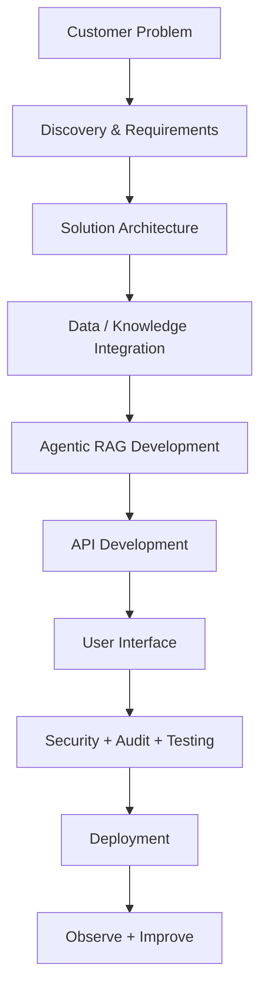
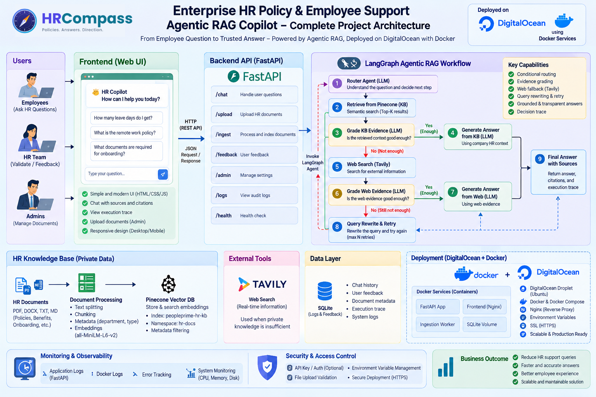
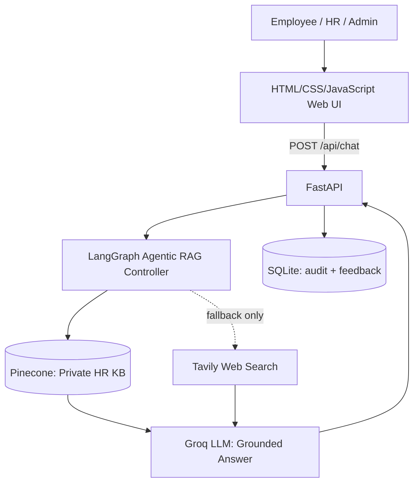
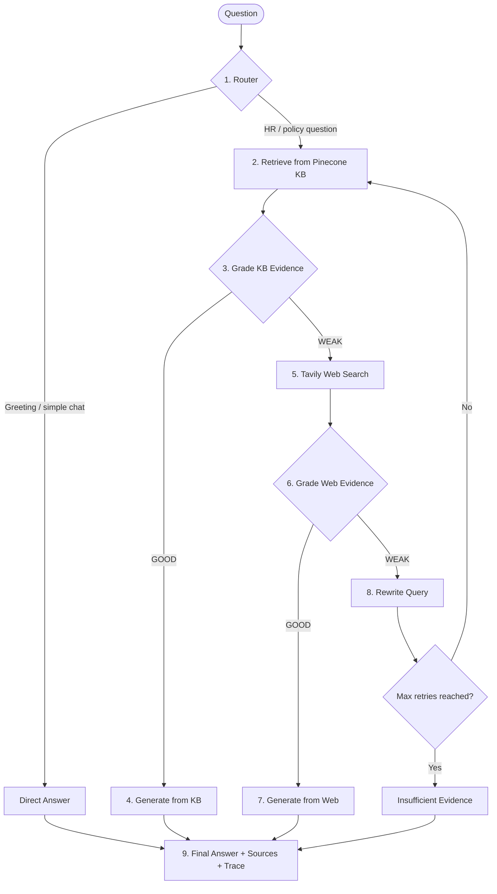

# HRCompass HR Copilot — Enterprise HR Policy & Employee Support Agentic RAG

An end-to-end Forward Deployed Engineer (FDE) project that turns an Agentic RAG workflow into a deployable internal HR product using **LangGraph, FastAPI, Pinecone, Groq, Tavily, HTML/CSS/JavaScript**, packaged with **Docker** and deployed on **DigitalOcean**.


---

## 1. Business Problem

### Customer
**HRCompass**, a fictional 3,000-employee retail company.

### Problem
The HR team maintains many internal documents: leave policies, remote-work rules, payroll guidance, benefits information, onboarding procedures, conduct policies, and HR operations runbooks.

Employees still send repetitive HR questions because:

- they do not know where the correct policy lives,
- keyword search returns too many documents,
- generic chatbots may invent policy details,
- internal documents may not cover current public regulations,
- some questions require fresh external information.

### Example
An employee asks:

> "How many annual leave days do employees receive?"

The answer exists in the private HR knowledge base, so the system answers from internal policy **without searching the public internet**.

Another employee asks:

> "What are the latest public holiday rules in Bangladesh?"

The internal KB may not contain current public information. The system recognizes weak private evidence, uses external search, grades the evidence, and clearly labels the answer as **external information requiring HR validation**.

### Business Goal
Build a secure HR Policy Copilot that:

1. Searches trusted private HR knowledge first.
2. Checks whether retrieved evidence is sufficient.
3. Uses web search only when private knowledge is insufficient.
4. Rewrites weak queries and retries.
5. Generates grounded answers with citations.
6. Shows the LangGraph decision path for transparency and debugging.
7. Lets authorized HR staff add new company documents.

---

## 2. Why This Is an FDE Project

A Forward Deployed Engineer does more than build an LLM notebook. The FDE translates a customer problem into a usable product:



---

## 3. Architecture

Workflow:


---

## 4. Agentic RAG Workflow



| Step | Node | What it does |
|---|---|---|
| 1 | Router (LLM) | Decides whether the question is chat or an HR question |
| 2 | Retrieve | Semantic top-K search in the private Pinecone KB |
| 3 | Grade KB | LLM checks whether the retrieved context is good enough |
| 4 | Generate from KB | Answers using only company HR context |
| 5 | Web Search | Tavily search for external/current information |
| 6 | Grade Web | LLM checks whether web evidence is good enough |
| 7 | Generate from Web | Answers from web evidence, flagged for HR validation |
| 8 | Rewrite & Retry | Rewrites the query and retries the KB (max N retries) |
| 9 | Final Answer | Returns answer, citations, and execution trace |

---

## 5. Technology Stack

| Layer | Technology | Purpose |
|---|---|---|
| Agent workflow | LangGraph | Stateful routing and conditional decisions |
| LLM | Groq (`llama-3.3-70b-versatile`) | Routing, grading, rewriting, answer generation |
| Embeddings | `sentence-transformers/all-MiniLM-L6-v2` (384-d) | Vector embeddings |
| Vector DB | Pinecone | Private enterprise HR knowledge base |
| External search | Tavily | Fallback when the HR KB is insufficient |
| API | FastAPI | Backend and REST endpoints |
| Frontend | HTML / CSS / JavaScript | Employee-facing interface |
| Data layer | SQLite | Chat history, feedback, metadata, decision-path audit |
| Observability | LangSmith + Docker/app logs | Tracing and monitoring |
| Packaging | Docker + Docker Compose | Reproducible deployment |
| Hosting | DigitalOcean Droplet + Nginx | Production deployment with HTTPS |

---

## 6. API Endpoints

| Endpoint | Purpose |
|---|---|
| `POST /api/chat` | Handle user questions |
| `POST /api/upload` | Upload HR documents |
| `POST /api/ingest` | Process and index documents |
| `POST /api/feedback` | Submit user feedback |
| `/api/admin` | Manage settings (API-key protected) |
| `GET /api/logs` | View audit logs |
| `GET /api/health` | Health check |

---

## 7. Project Structure

```text
HRCompass-HR-Policy-Agentic-RAG-Copilot/
├── app/
│   ├── api/routes.py
│   ├── core/config.py
│   ├── core/logging.py
│   ├── rag/state.py
│   ├── rag/vectorstore.py
│   ├── rag/workflow.py
│   ├── services/audit.py
│   ├── services/ingestion.py
│   └── main.py
├── data/sample_kb/
│   ├── company_hr_handbook.md
│   └── hr_operations_runbook.md
├── docs/
│   └── architecture.svg
├── static/
│   ├── css/style.css
│   └── js/app.js
├── templates/index.html
├── uploads/
├── Dockerfile
├── docker-compose.yml
├── ingest_sample_kb.py
├── requirements.txt
├── run.py
└── README.md
```

---

## 8. Setup

### Step 1 — Create and activate a virtual environment

```bash
python -m venv venv
```

Windows:

```bash
venv\Scripts\activate
```

macOS/Linux:

```bash
source venv/bin/activate
```

### Step 2 — Install dependencies

```bash
pip install -r requirements.txt
```

### Step 3 — Configure environment

Copy `.env.example` to `.env` and add your keys.

```env
GROQ_API_KEY=your_groq_api_key_here
GROQ_MODEL=llama-3.3-70b-versatile
TAVILY_API_KEY=your_tavily_api_key_here
PINECONE_API_KEY=your_pinecone_api_key_here
PINECONE_INDEX_NAME=fde-hr-policy-rag
PINECONE_NAMESPACE=company-hr-kb
EMBEDDING_MODEL=sentence-transformers/all-MiniLM-L6-v2
ADMIN_API_KEY=change-me-in-production
APP_ENV=development

# Optional: LangSmith tracing
LANGSMITH_TRACING=true
LANGSMITH_ENDPOINT=https://api.smith.langchain.com
LANGSMITH_API_KEY=your_langsmith_api_key_here
LANGSMITH_PROJECT=FDE-HR_PROJECT
```

> ⚠️ **Never commit `.env` or share real API keys.** Add `.env` to `.gitignore` and rotate any key that has been exposed.

> **Embedding dimension:** `all-MiniLM-L6-v2` produces **384-dimensional** vectors. Create the Pinecone index with `dimension=384` and `metric=cosine`. If you switch embedding models, recreate the index and re-ingest your documents.

### Step 4 — Load sample HR knowledge

```bash
python ingest_sample_kb.py
```

### Step 5 — Run the application

```bash
python run.py
```

Open `http://127.0.0.1:8080` and the FastAPI docs at `http://127.0.0.1:8080/docs`.

---

## 9. Demo Scenarios

### Demo A — Private KB Success
Ask: **How many annual leave days do employees receive?**

```text
Router → KB
Private KB Retrieval
KB Grade → GOOD
Generate from Private KB
```

### Demo B — Company Policy Question
Ask: **How many days per week can I work remotely?**

Expected result: answer from the internal HR handbook, without web search.

### Demo C — External / Current Information
Ask: **What are the latest public holiday rules in Bangladesh?**

```text
Router → KB
Private KB Retrieval
KB Grade → WEAK
Tavily Search
Web Grade → GOOD
Web Answer (flagged for HR validation)
```

### Demo D — Weak Query Rewrite
Ask an ambiguous HR question such as: **What happens if mine is wrong?**

If neither private nor web evidence is sufficient, the workflow rewrites the query, retries the KB, and eventually stops with **insufficient evidence** rather than hallucinating.

---

## 10. Deployment (Docker on DigitalOcean)

```text
DigitalOcean Droplet (Ubuntu)
└── Docker Compose
    ├── FastAPI app
    ├── Frontend (Nginx reverse proxy)
    ├── Ingestion worker
    └── SQLite volume
```

1. Create an Ubuntu Droplet and install Docker + Docker Compose.
2. Clone the repository and create the production `.env` (strong `ADMIN_API_KEY`, `APP_ENV=production`).
3. Build and start the stack:

   ```bash
   docker compose up -d --build
   ```
4. Point your domain at the Droplet and enable HTTPS with Let's Encrypt (Certbot) behind Nginx.
5. Check logs with `docker compose logs -f`.

---

## 11. Security & Observability

- API-key protection for admin routes
- File upload validation (type and size)
- Secrets via environment variables only
- HTTPS in production
- SQLite audit trail of every decision path
- LangSmith tracing, application logs, Docker logs, and system monitoring (CPU / memory / disk)

---

## 12. Business Outcome

- Fewer repetitive HR support queries
- Faster and more accurate answers with citations
- Better employee experience
- Scalable and maintainable solution

---

## 13. What Changed From the IT Support Reference

The application structure, graph topology, API shape, retrieval logic, ingestion layer, audit layer, Docker setup, and frontend behavior remain the same. Only domain-specific elements were changed: HR prompts, HR configuration names, UI wording, example questions, sample documents, and documentation.

The LLM provider was also switched from OpenAI to **Groq**, and embeddings from OpenAI `text-embedding-3-small` to local **all-MiniLM-L6-v2**, since Groq does not provide an embeddings API.
